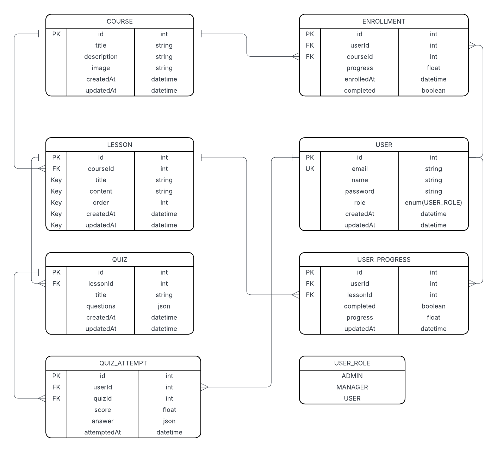

# Skill Stream - Learning Management System

<a href="https://en.fa.ru/">
  
</a>

### Course Project
**Subject:** Web Application Development  
**Program:** Data Engineering  
**Semester:** 5th

## Database ER Diagram



## Project Overview

**Skill Stream** is a full-featured Learning Management System (LMS) built as a monorepo application using modern web technologies.

### Tech Stack
- **Backend**: NestJS (TypeScript) + Prisma ORM + PostgreSQL
- **Frontend**: React 19 (TypeScript) + TanStack Query + React Router + SCSS
- **Monorepo tools**: Turborepo + pnpm workspaces + Vite

### Key Features
- User registration and JWT-based authentication
- Course catalog with enrollment functionality
- Lesson viewing with rich HTML content and multiple-choice quizzes
- Progress tracking for lessons and courses
- Role-based access control (USER, MANAGER, ADMIN)
- Comprehensive admin panel for managing users, courses, lessons, quizzes, enrollments, progress, and quiz attempts

The project follows best practices: full type safety from database to UI, modular architecture, RESTful API, RBAC with custom Guards, and responsive design.

---

## Setup Steps

### 1. Clone the repository

```bash
git clone https://github.com/sorawalker/skill-stream.git
cd skill-stream
```

### 2. Install dependencies

```bash
pnpm install
```

### 3. Configure environment variables

Copy `.env.example` to `.env` and fill in the values.

**Important:** set `DATABASE_URL` (PostgreSQL connection string).

```bash
cd backend
cp .env.example .env
```

### 4. Generate Prisma client

```bash
pnpm prisma:generate
```

### 5. Apply database migrations

Creates tables and applies schema changes.

```bash

pnpm prisma:migrate
```

### 6. Start development servers (backend + frontend)

```bash
cd ..
pnpm turbo dev
```

---
